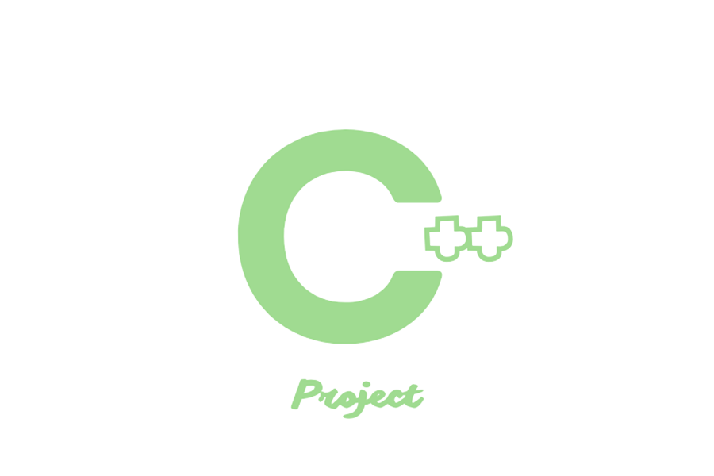

<p align="center"><a></a></p>

<div align="center">

[](https://ko-fi.com/dominic_kofi) [](https://www.patreon.com/user?u=57078534)

</div>

<br/>

## Introduce

Template project Cpp with [Cmake](https://cmake.org/)

<br/>

## Requirements

- a modern C++17 compiler (`gcc-8`, `clang-6.0`, `MSVC 2017` or above)
- [cmake](https://cmake.org) 3.15+
- [make](https://www.gnu.org/software/make/manual/make.html)
- [git](https://git-scm.com/) (Optional)

### Required for windows

**Step 1**: Install choco

- [choco](https://chocolatey.org/install)

**Step 2**: Install package

- [make](https://community.chocolatey.org/packages/make)
- [mingw](https://community.chocolatey.org/packages/llvm)

```
   choco install mingw make
```

<br/>

## Features

- CMake-based project management, including dependencies
- Support for shared/static libraries, including generation of export information
- CI workflows for Windows, Linux and MacOS using GitHub Actions, making use of the caching features, to ensure minimum run time
- Permissive license to allow you to integrate it as easily as possible. The template is licensed under the Unlicense,

<br/>

## Project structure

```
   CppProject
   │  
   ├── build      
   │  
   ├── include
   |   |
   |   ├── lib          library 
   |   |    └── *.h      
   |   |
   │   └── *.h
   │  
   ├── src
   |   |
   |   ├── lib          library source
   |   |    └── *.cpp
   |   | 
   |   ├── *.cpp
   │   └── main.cpp
   │  
   ├── .gitignore
   ├── CmakeLists.txt
   ├── LICENSE
   └── Makefile
```

<br/>

## Install

Clone my project with [git](https://git-scm.com/)

- ```
  git clone https://github.com/Dominic-github/CppProject --depth 1 [Name Your Project]
  ```

OR dowload zip

- [https://github.com/Dominic-github/CppProject/archive/refs/heads/main.zip](https://github.com/Dominic-github/CppProject/archive/refs/heads/main.zip)

<br/>

## How to build

**Step 1**: Run make setup to initialize the project with [git](https://git-scm.com/)

- ```
  make setup
  ```

  <br/>


**Step 2**: Build project

- ```
  make all
  make rebuild
  ```
  <br/>

**Step 3**: Run file from root Project

- ```
  make run
  ```

You can see more make on [Makefile](https://github.com/Dominic-github/CppProject/blob/main/Makefile)

<br/>

## Q&A

### How to build again?

- Run make on folder build, see on [Makefile](https://github.com/Dominic-github/CppProject/blob/main/Makefile)
```
    make rebuild
```
### Create lib folder
 - You can create folder on [include](https://github.com/Dominic-github/CppProject/blob/main/include) and [src](https://github.com/Dominic-github/CppProject/blob/main/src) with name's folder is lib
  ```
    mkdir include/lib
    mkdir src/lib
  ```
### Support git action

- You should make changes in the GitHub workflows provided, notably [.github/workflows/ubuntu.yml](https://github.com/Dominic-github/CppProject/blob/main/.github/workflows/ubuntu.yml)


<br/>

## ❤️ Support

- If you like this project can support me

[](https://ko-fi.com/Dominic_kofi)
[](https://paypal.me/DominicPPal)
[](https://www.patreon.com/Dominic_patreon)

<br/>

## License

[MIT](https://opensource.org/licenses/MIT)

Copyright (c) 2023-present, Tan Hoang
